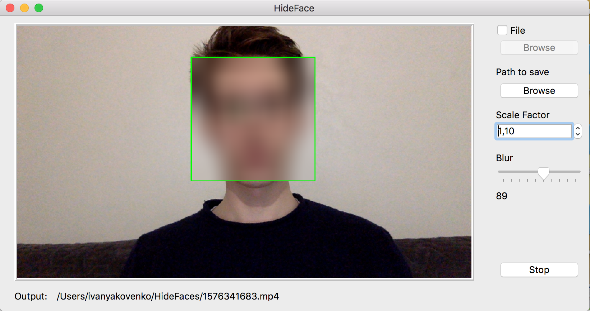
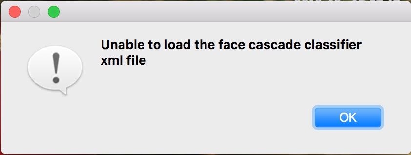

# HideFace
[](https://travis-ci.org/meyakovenkoj/hideface)
## Installation

OS X & Linux:

```bash
python -m venv venv
. venv/bin/activate
pip install -r requirements.txt
python main.py
```

Or if u using Windows:

```bash
python -m venv venv
venv\Scripts\activate.bat
pip install -r requirements.txt
python main.py
```

## Usage example

When you start `main.py`, PyQt will open this window:


* Button + checkbox 'File' to choose source (unchecked - webcam, checked - your own MP4 file)
* Use button browse to choose path to save output
* Scale factor is the coefficient of scale for sliding window algorithm (higher means less accurancy but higher speed)
* Slider blur allows you to choose coefficient if Gaussian Blur for image 
* Push 'Start' button to start this program. It will become 'Stop' to allow you to stop writing file.

Program in action:




File choosing window:


If you don't choose file source, you'll get error:
> To solve it choose correct .mp4 file or remove check in 'File' checkbox (this means you want to use webcam instead)


If you don't choose saving folder, you'll get another error:
> To solve it just choose correct path to save


And the last error is unavalible haar cascade:
> To solve it just put your cascade in project folder with name `haarcascade_frontalface_alt2.xml`



## Known issues
Almost all problems are listed in issues page. But if you've found smth please add it to help me improve this project.
* Sometimes users get QtQPA error while running app. I don't understand why...

## Meta

Yakovenko Ivan – [@meyakovenkoj](https://vk.com/meyakovenkoj) – ivan.yakovenko@icloud.com

[https://github.com/meyakovenkoj/](https://github.com/meyakovenkoj/)

## Contributing

1. Fork it (<https://github.com/meyakovenkoj/hideface/fork>)
2. Create your feature branch (`git checkout -b feature/fooBar`)
3. Commit your changes (`git commit -am 'Add some fooBar'`)
4. Push to the branch (`git push origin feature/fooBar`)
5. Create a new Pull Request

